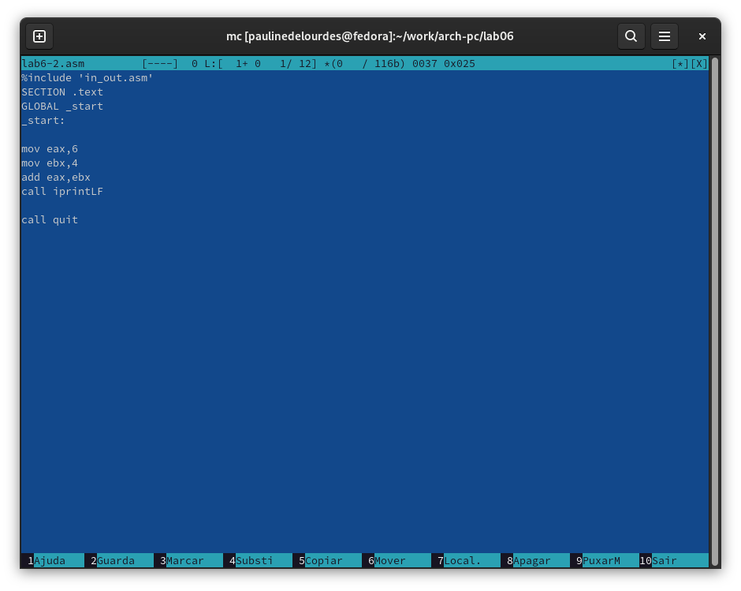
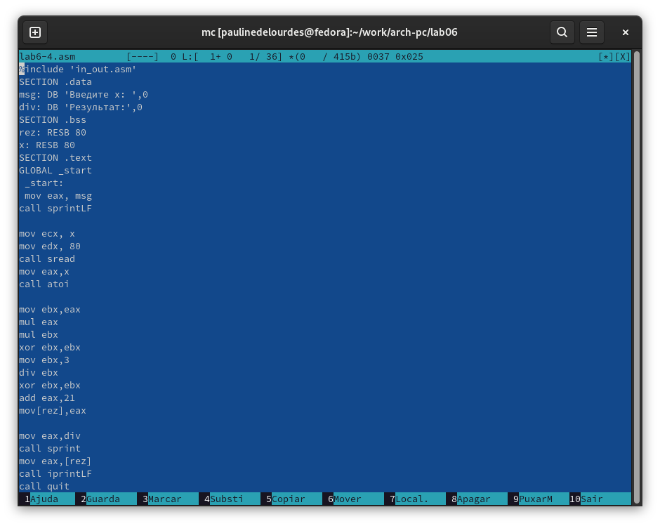

---
## Front matter
title: "Шаблон отчёта по лабораторной работе"
subtitle: "Простейший вариант"
author: "Дмитрий Сергеевич Кулябов"

## Generic otions
lang: ru-RU
toc-title: "Содержание"

## Bibliography
bibliography: bib/cite.bib
csl: pandoc/csl/gost-r-7-0-5-2008-numeric.csl

## Pdf output format
toc: true # Table of contents
toc-depth: 2
lof: true # List of figures
lot: true # List of tables
fontsize: 12pt
linestretch: 1.5
papersize: a4
documentclass: scrreprt
## I18n polyglossia
polyglossia-lang:
  name: russian
  options:
	- spelling=modern
	- babelshorthands=true
polyglossia-otherlangs:
  name: english
## I18n babel
babel-lang: russian
babel-otherlangs: english
## Fonts
mainfont: IBM Plex Serif
romanfont: IBM Plex Serif
sansfont: IBM Plex Sans
monofont: IBM Plex Mono
mathfont: STIX Two Math
mainfontoptions: Ligatures=Common,Ligatures=TeX,Scale=0.94
romanfontoptions: Ligatures=Common,Ligatures=TeX,Scale=0.94
sansfontoptions: Ligatures=Common,Ligatures=TeX,Scale=MatchLowercase,Scale=0.94
monofontoptions: Scale=MatchLowercase,Scale=0.94,FakeStretch=0.9
mathfontoptions:
## Biblatex
biblatex: true
biblio-style: "gost-numeric"
biblatexoptions:
  - parentracker=true
  - backend=biber
  - hyperref=auto
  - language=auto
  - autolang=other*
  - citestyle=gost-numeric
## Pandoc-crossref LaTeX customization
figureTitle: "Рис."
tableTitle: "Таблица"
listingTitle: "Листинг"
lofTitle: "Список иллюстраций"
lotTitle: "Список таблиц"
lolTitle: "Листинги"
## Misc options
indent: true
header-includes:
  - \usepackage{indentfirst}
  - \usepackage{float} # keep figures where there are in the text
  - \floatplacement{figure}{H} # keep figures where there are in the text
---

# Цель работы

Ознакомиться с языком разметки Markdown и оформить отчет по лабораторной работе №2 в ней.

# Задание

Сформировать отчет по лабораторной работе №2 с помощью Markdown.

# Выполнение лабораторной работы №3

Переходим в каталог, который привязан к репозиторию Git на сайте Github. (рис. @fig:001).

{#fig:001 width=70%}

С помощью команды git pull обновляем локальный репозиторий,скачивая изменения. (рис. @fig:002).

{#fig:002 width=70%}

Переходим в каталог report 3 лабораторной работы. (рис. @fig:003).

{#fig:003 width=70%}

Используем команду make для создания файлов report.pdf и report.docx (рис. @fig:004).

{#fig:004 width=70%}

Проверяем, как сработала команда make (рис. @fig:005).

{#fig:005 width=70%}

Используем команду make clean, которая удаляет недавно созданные документы(рис. @fig:006).

{#fig:006 width=70%}

Открываем файлы и смотрим, сработала ли команда make clean(рис. @fig:007).

{#fig:007 width=70%}

Используем команду gedit report.md, которая открывает редактор данного документа (рис. @fig:008).

{#fig:008 width=70%}

Изучаем открывшийся файл(рис. @fig:009).

{#fig:009 width=70%}

Изучив структуру файла, начинаем его изменять(рис. @fig:010).

{#fig:010 width=70%}

# Делаем отчет лабораторной работы №2

Делаем предварительную конфигурацию git. (рис. @fig:001).

{#fig:001 width=70%}

Настраиваем utf-8 в выводе сообщения git. (рис. @fig:002).

{#fig:002 width=70%}

Задаем имя начальной ветки. (рис. @fig:003).

{#fig:003 width=70%}

{#fig:004 width=70%}

{#fig:005 width=70%}

Создаем SSH ключ(рис. @fig:006).

{#fig:006 width=70%}

{#fig:007 width=70%}

Заходим в свой аккаунт на сайте github. Переходим в настройки, SSH ключи. (рис. @fig:008).

{#fig:008 width=70%}

{#fig:009 width=70%}

Открываем терминал и создаем каталоги для предмета "Архитектура компьютера"(рис. @fig:010).

{#fig:010 width=70%}

Переходим на страницу репозитория с шаблоном(рис. @fig:011).

{#fig:011 width=70%}

Переходим в папку с предметом(рис. @fig:012).

{#fig:012 width=70%}

{#fig:013 width=70%}

Переходим в каталог arch-pc(рис. @fig:013).

{#fig:013 width=70%}

{#fig:014 width=70%}

Создаем папки по образцу(рис. @fig:015).

{#fig:015 width=70%}

Отправляем файлы на сервер(рис. @fig:016).

{#fig:016 width=70%}

Отправляем прошлую лабораторную работу(рис. @fig:017).

{#fig:017 width=70%}

# Выводы

Мы познакомились с языком разметки Markdown и оформили отчет в ней и загрузили на Github.
